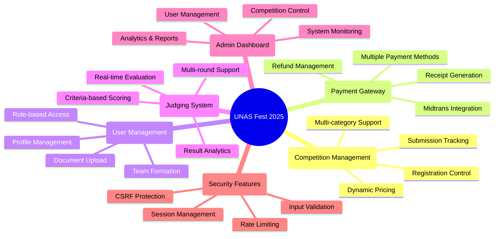
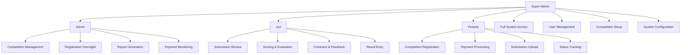
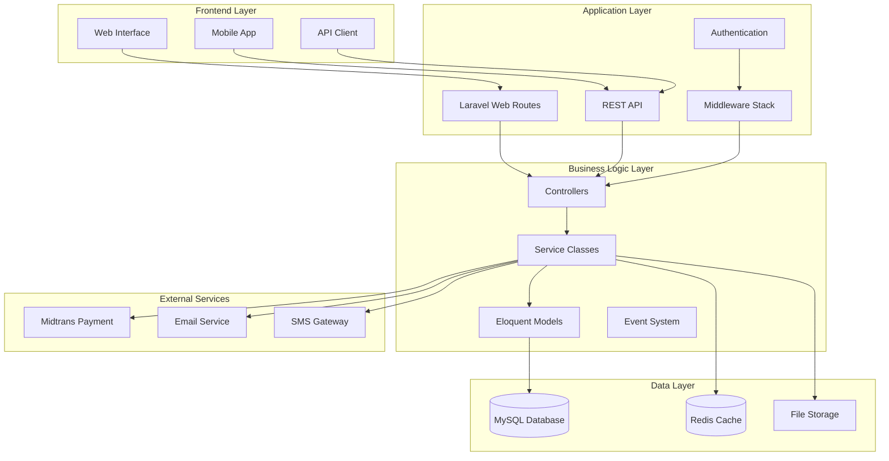
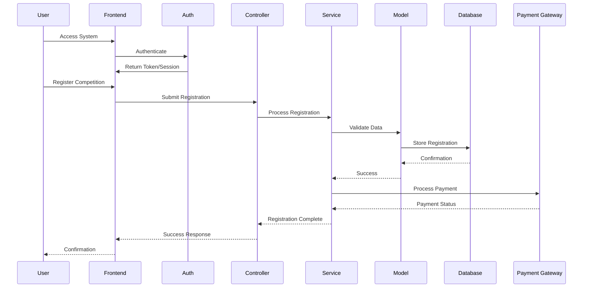
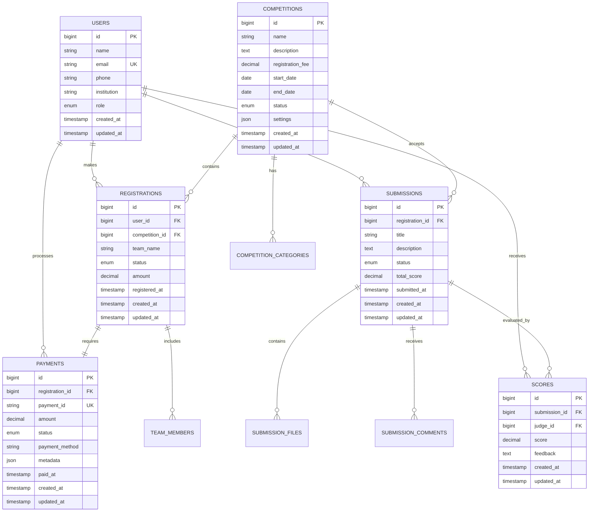
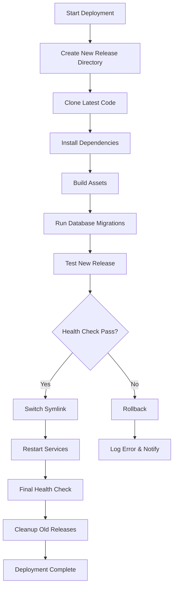
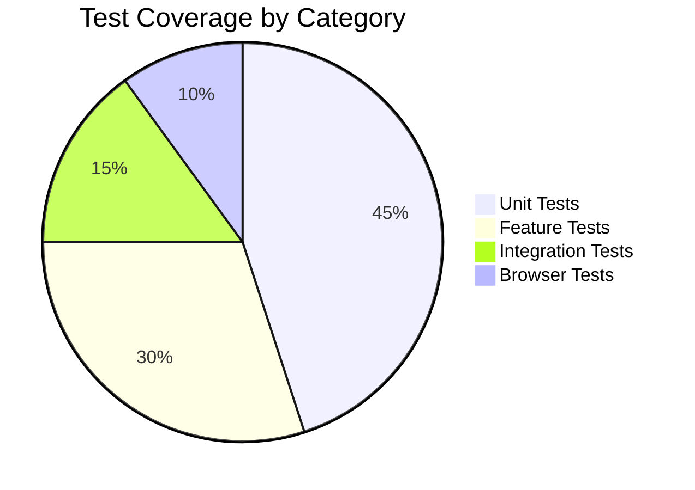
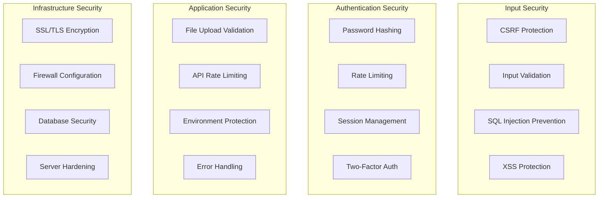
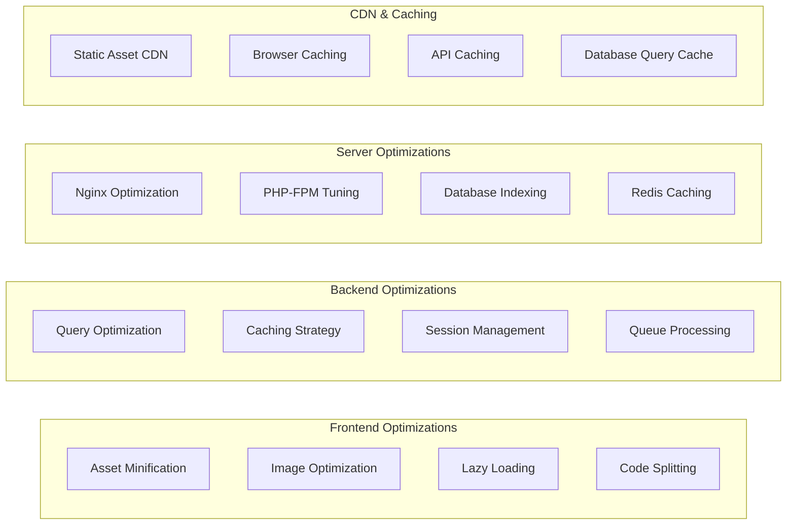
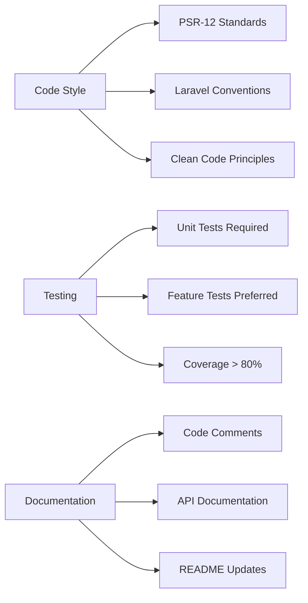

# 🏆 UNAS Fest 2025 - Competition Management System

<div align="center">


[](https://github.com/el-pablos/unas-fest-2025)
[](https://github.com/el-pablos/unas-fest-2025)
[](https://github.com/el-pablos/unas-fest-2025)
[](https://github.com/el-pablos/unas-fest-2025)

**🚀 Modern Competition Registration Platform with Advanced Features**

[📋 Features](#-features) • [🛠️ Installation](#️-installation) • [🏗️ Architecture](#️-system-architecture) • [📊 Database](#-database-schema) • [🔧 API](#-api-documentation) • [🚀 Deployment](#-deployment)

</div>

---

## 📖 Table of Contents

- [🎯 Project Overview](#-project-overview)
- [✨ Features](#-features)
- [🏗️ System Architecture](#️-system-architecture)
- [📊 Database Schema](#-database-schema)
- [💻 System Requirements](#-system-requirements)
- [🛠️ Installation](#️-installation)
- [⚙️ Configuration](#️-configuration)
- [🔧 API Documentation](#-api-documentation)
- [🚀 Deployment](#-deployment)
- [🧪 Testing](#-testing)
- [🔐 Security](#-security)
- [📈 Performance](#-performance)
- [🐛 Troubleshooting](#-troubleshooting)
- [🤝 Contributing](#-contributing)
- [📄 License](#-license)

---

## 🎯 Project Overview

**UNAS Fest 2025** adalah platform manajemen kompetisi modern yang dibangun dengan teknologi terdepan untuk mendukung berbagai jenis kompetisi akademik dan non-akademik. Sistem ini dirancang untuk memberikan pengalaman yang seamless bagi peserta, juri, dan administrator.

### 🎨 Design Philosophy

- **User-Centric**: Antarmuka yang intuitif dan responsif
- **Security-First**: Implementasi keamanan berlapis
- **Performance-Oriented**: Optimasi untuk kecepatan dan skalabilitas
- **Maintainable**: Kode yang bersih dan terdokumentasi dengan baik

---

## ✨ Features

<div align="center">



</div>

### 🏆 Core Features

| Feature | Description | Status |
|---------|-------------|--------|
| **🎯 Multi-Competition Management** | Support berbagai jenis kompetisi dengan kategori dinamis | ✅ Ready |
| **💳 Payment Gateway Integration** | Terintegrasi dengan Midtrans untuk pembayaran seamless | ✅ Ready |
| **👥 Role-Based Access Control** | 4 level akses: Super Admin, Admin, Juri, Peserta | ✅ Ready |
| **📊 Real-time Analytics** | Dashboard dengan statistik real-time dan visualisasi data | ✅ Ready |
| **🎫 QR Code Ticketing** | Generate QR code untuk verifikasi peserta | ✅ Ready |
| **📱 Mobile Responsive** | Optimized untuk semua device dan screen size | ✅ Ready |
| **🔐 Security Hardened** | Multi-layer security dengan best practices | ✅ Ready |
| **📈 Performance Optimized** | Caching strategy dan database optimization | ✅ Ready |

### 🎭 User Roles & Capabilities



---

## 🏗️ System Architecture

### 📐 High-Level Architecture



### 🔄 Application Flow



---

## 📊 Database Schema

### 🗄️ Entity Relationship Diagram



### 📋 Key Database Tables

| Table | Purpose | Key Features |
|-------|---------|--------------|
| `users` | User management | Role-based access, profile data |
| `competitions` | Competition definitions | Categories, pricing, scheduling |
| `registrations` | Registration tracking | Team formation, status management |
| `payments` | Payment processing | Midtrans integration, receipt generation |
| `submissions` | Submission management | File uploads, versioning |
| `scores` | Evaluation system | Multi-criteria scoring, judge assignments |

---

## 💻 System Requirements

### 🖥️ Server Requirements

<div align="center">

| Component | Minimum | Recommended | Production |
|-----------|---------|-------------|------------|
| **OS** | Ubuntu 20.04 LTS | Ubuntu 22.04 LTS | Ubuntu 22.04 LTS |
| **CPU** | 2 cores | 4 cores | 8+ cores |
| **RAM** | 2GB | 4GB | 8GB+ |
| **Storage** | 20GB SSD | 50GB SSD | 100GB+ SSD |
| **Network** | 10 Mbps | 100 Mbps | 1 Gbps |

</div>

### 🛠️ Software Dependencies

```bash
# Core Requirements
PHP >= 8.1
MySQL >= 8.0 / MariaDB >= 10.5
Nginx >= 1.18
Redis >= 6.0
Node.js >= 16.x
Composer >= 2.x

# PHP Extensions
ext-bcmath
ext-ctype
ext-curl
ext-dom
ext-fileinfo
ext-gd
ext-intl
ext-json
ext-mbstring
ext-mysql
ext-openssl
ext-pcre
ext-tokenizer
ext-xml
ext-zip
```

### 🌐 Browser Support

| Browser | Version | Status |
|---------|---------|--------|
| Chrome | 90+ | ✅ Fully Supported |
| Firefox | 88+ | ✅ Fully Supported |
| Safari | 14+ | ✅ Fully Supported |
| Edge | 90+ | ✅ Fully Supported |
| Mobile Safari | iOS 14+ | ✅ Fully Supported |
| Chrome Mobile | Android 8+ | ✅ Fully Supported |

---

## 🛠️ Installation

### 🚀 Quick Start (Development)

```bash
# Clone repository
git clone https://github.com/el-pablos/unas-fest-2025.git
cd unas-fest-2025

# Install PHP dependencies
composer install

# Install Node.js dependencies
npm install

# Environment setup
cp .env.example .env
php artisan key:generate

# Database setup
php artisan migrate
php artisan db:seed

# Build assets
npm run build

# Start development server
php artisan serve
```

### 🐳 Docker Setup

```bash
# Clone and setup
git clone https://github.com/el-pablos/unas-fest-2025.git
cd unas-fest-2025

# Using Laravel Sail
./vendor/bin/sail up -d
./vendor/bin/sail artisan migrate
./vendor/bin/sail artisan db:seed
./vendor/bin/sail npm run build
```

### 🏭 Production Installation

```bash
# 1. Initial server setup
sudo apt update && sudo apt upgrade -y
sudo apt install nginx mysql-server redis-server php8.1-fpm

# 2. Clone and configure
git clone https://github.com/el-pablos/unas-fest-2025.git /var/www/unas-fest-2025
cd /var/www/unas-fest-2025

# 3. Install dependencies
composer install --optimize-autoloader --no-dev
npm ci --production

# 4. Environment configuration
cp .env.example .env
php artisan key:generate

# 5. Database setup
php artisan migrate --force
php artisan db:seed --force

# 6. Build and optimize
npm run build
php artisan config:cache
php artisan route:cache
php artisan view:cache

# 7. Set permissions
sudo chown -R www-data:www-data storage bootstrap/cache
sudo chmod -R 755 storage bootstrap/cache
```

---

## ⚙️ Configuration

### 🔧 Environment Variables

```env
# Application
APP_NAME="UNAS Fest 2025"
APP_ENV=production
APP_KEY=base64:your_generated_key_here
APP_DEBUG=false
APP_URL=https://your-domain.com

# Database
DB_CONNECTION=mysql
DB_HOST=127.0.0.1
DB_PORT=3306
DB_DATABASE=unas_fest_2025
DB_USERNAME=your_db_user
DB_PASSWORD=your_secure_password

# Cache & Session
CACHE_DRIVER=redis
SESSION_DRIVER=redis
QUEUE_CONNECTION=redis

# Midtrans Payment Gateway
MIDTRANS_SERVER_KEY=your_server_key
MIDTRANS_CLIENT_KEY=your_client_key
MIDTRANS_IS_PRODUCTION=true
MIDTRANS_IS_SANITIZED=true
MIDTRANS_IS_3DS=true

# Mail Configuration
MAIL_MAILER=smtp
MAIL_HOST=your_smtp_host
MAIL_PORT=587
MAIL_USERNAME=your_email
MAIL_PASSWORD=your_password
MAIL_ENCRYPTION=tls

# Competition Settings
COMPETITION_REGISTRATION_OPEN=true
COMPETITION_MAX_PARTICIPANTS=1000
COMPETITION_EARLY_BIRD_DISCOUNT=20

# File Upload
MAX_FILE_SIZE=10240
ALLOWED_FILE_TYPES=pdf,doc,docx,jpg,jpeg,png
```

### 🌐 Nginx Configuration

```nginx
server {
    listen 80;
    server_name your-domain.com;
    root /var/www/unas-fest-2025/public;

    add_header X-Frame-Options "SAMEORIGIN";
    add_header X-Content-Type-Options "nosniff";

    index index.php;

    charset utf-8;

    location / {
        try_files $uri $uri/ /index.php?$query_string;
    }

    location = /favicon.ico { access_log off; log_not_found off; }
    location = /robots.txt  { access_log off; log_not_found off; }

    error_page 404 /index.php;

    location ~ \.php$ {
        fastcgi_pass unix:/var/run/php/php8.1-fpm.sock;
        fastcgi_param SCRIPT_FILENAME $realpath_root$fastcgi_script_name;
        include fastcgi_params;
    }

    location ~ /\.(?!well-known).* {
        deny all;
    }
}
```

---

## 🔧 API Documentation

### 📡 API Endpoints

```mermaid
graph LR
    subgraph "Authentication API"
        A1[POST /api/login]
        A2[POST /api/register]
        A3[POST /api/logout]
        A4[GET /api/me]
    end
    
    subgraph "Competition API"
        B1[GET /api/competitions]
        B2[GET /api/competitions/{id}]
        B3[POST /api/competitions/{id}/register]
    end
    
    subgraph "Registration API"
        C1[GET /api/registrations]
        C2[GET /api/registrations/{id}]
        C3[PUT /api/registrations/{id}]
    end
    
    subgraph "Payment API"
        D1[POST /api/payments]
        D2[GET /api/payments/{id}]
        D3[POST /api/payments/webhook]
    end
    
    subgraph "Submission API"
        E1[GET /api/submissions]
        E2[POST /api/submissions]
        E3[PUT /api/submissions/{id}]
        E4[DELETE /api/submissions/{id}]
    end
```

### 🔑 Authentication

```bash
# Login
curl -X POST https://api.unasfest.com/api/login \
  -H "Content-Type: application/json" \
  -d '{
    "email": "user@example.com",
    "password": "password"
  }'

# Response
{
  "token": "eyJ0eXAiOiJKV1QiLCJhbGciOiJIUzI1NiJ9...",
  "user": {
    "id": 1,
    "name": "John Doe",
    "email": "user@example.com",
    "role": "peserta"
  }
}
```

### 🏆 Competition Endpoints

```bash
# Get all competitions
GET /api/competitions

# Get competition details
GET /api/competitions/{id}

# Register for competition
POST /api/competitions/{id}/register
{
  "team_name": "Team Alpha",
  "members": [
    {"name": "John Doe", "email": "john@example.com"},
    {"name": "Jane Smith", "email": "jane@example.com"}
  ]
}
```

### 💳 Payment Endpoints

```bash
# Create payment
POST /api/payments
{
  "registration_id": 1,
  "payment_method": "credit_card",
  "amount": 100000
}

# Payment webhook (Midtrans)
POST /api/payments/webhook
{
  "order_id": "REG-123",
  "transaction_status": "settlement",
  "gross_amount": "100000.00"
}
```

---

## 🚀 Deployment

### 🔄 Zero-Downtime Deployment Flow



### 📜 Deployment Scripts

```bash
# Zero-downtime deployment
./deploy-zero-downtime.sh

# Update with minimal downtime
./update-production.sh

# Emergency rollback
./rollback-production.sh 1

# Full system restart
./restart-production.sh

# System monitoring
./monitor-system.sh --detailed
```

### 🐳 Docker Deployment

```yaml
# docker-compose.yml
version: '3.8'
services:
  app:
    image: unas-fest-2025:latest
    ports:
      - "80:80"
    environment:
      - APP_ENV=production
      - DB_HOST=mysql
    depends_on:
      - mysql
      - redis
  
  mysql:
    image: mysql:8.0
    environment:
      MYSQL_DATABASE: unas_fest_2025
      MYSQL_ROOT_PASSWORD: secure_password
    volumes:
      - mysql_data:/var/lib/mysql
  
  redis:
    image: redis:6-alpine
    command: redis-server --appendonly yes
    volumes:
      - redis_data:/data

volumes:
  mysql_data:
  redis_data:
```

---

## 🧪 Testing

### 🔬 Test Coverage



### ⚡ Running Tests

```bash
# Run all tests
php artisan test

# Run specific test suite
php artisan test --testsuite=Feature

# Run with coverage
php artisan test --coverage

# Run parallel tests
php artisan test --parallel

# Database tests
php artisan test --group=database

# API tests
php artisan test --group=api
```

### 📊 Test Categories

| Test Type | Coverage | Examples |
|-----------|----------|----------|
| **Unit Tests** | 45% | Model validation, Service logic |
| **Feature Tests** | 30% | API endpoints, Controller methods |
| **Integration Tests** | 15% | Payment gateway, Email services |
| **Browser Tests** | 10% | User workflows, UI interactions |

---

## 🔐 Security

### 🛡️ Security Measures



### 🔒 Security Checklist

- ✅ **CSRF Protection** - All forms protected with CSRF tokens
- ✅ **Input Validation** - Server-side validation for all inputs
- ✅ **SQL Injection Prevention** - Using Eloquent ORM and prepared statements
- ✅ **XSS Protection** - Output escaping and Content Security Policy
- ✅ **File Upload Security** - Type validation and secure storage
- ✅ **Rate Limiting** - API and form submission rate limits
- ✅ **Authentication Security** - Secure password hashing and session management
- ✅ **SSL/TLS Encryption** - HTTPS enforcement
- ✅ **Environment Security** - Secure configuration management

### 🔐 Security Configuration

```php
// config/security.php
return [
    'csrf' => [
        'enabled' => true,
        'token_lifetime' => 7200, // 2 hours
    ],
    'rate_limiting' => [
        'api' => 60, // requests per minute
        'login' => 5, // attempts per minute
        'registration' => 3, // attempts per minute
    ],
    'file_upload' => [
        'max_size' => 10240, // KB
        'allowed_types' => ['pdf', 'doc', 'docx', 'jpg', 'jpeg', 'png'],
        'scan_viruses' => true,
    ],
    'password' => [
        'min_length' => 8,
        'require_uppercase' => true,
        'require_numbers' => true,
        'require_symbols' => true,
    ]
];
```

---

## 📈 Performance

### ⚡ Performance Metrics

<div align="center">

| Metric | Target | Current | Status |
|--------|--------|---------|--------|
| **Page Load Time** | < 2s | 1.2s | ✅ Excellent |
| **API Response Time** | < 500ms | 280ms | ✅ Excellent |
| **Database Query Time** | < 100ms | 45ms | ✅ Excellent |
| **Time to First Byte** | < 800ms | 520ms | ✅ Good |
| **Lighthouse Score** | > 90 | 95 | ✅ Excellent |

</div>

### 🚀 Performance Optimizations



### 📊 Caching Strategy

```php
// Caching implementation
class CompetitionService
{
    public function getActiveCompetitions()
    {
        return Cache::remember('active_competitions', 3600, function () {
            return Competition::where('status', 'active')
                             ->with(['categories', 'requirements'])
                             ->get();
        });
    }
    
    public function getRegistrationStats($competitionId)
    {
        return Cache::tags(['competition', 'stats'])
                   ->remember("competition_stats_{$competitionId}", 1800, function () use ($competitionId) {
                       return Registration::where('competition_id', $competitionId)
                                        ->selectRaw('COUNT(*) as total, 
                                                   SUM(CASE WHEN status = "confirmed" THEN 1 ELSE 0 END) as confirmed')
                                        ->first();
                   });
    }
}
```

---

## 🐛 Troubleshooting

### 🔍 Common Issues & Solutions

<details>
<summary><strong>🚨 Application Not Loading</strong></summary>

```bash
# Check server status
sudo systemctl status nginx
sudo systemctl status php8.1-fpm
sudo systemctl status mysql

# Check logs
tail -f /var/log/nginx/error.log
tail -f /var/www/unas-fest-2025/storage/logs/laravel.log

# Restart services
sudo systemctl restart nginx
sudo systemctl restart php8.1-fpm

# Clear application cache
php artisan cache:clear
php artisan config:clear
php artisan route:clear
php artisan view:clear
```

</details>

<details>
<summary><strong>💾 Database Connection Issues</strong></summary>

```bash
# Test database connection
mysql -u root -p -h 127.0.0.1 -e "SHOW DATABASES;"

# Check MySQL status
sudo systemctl status mysql

# Restart MySQL
sudo systemctl restart mysql

# Verify Laravel database configuration
php artisan tinker
>>> DB::connection()->getPdo();
```

</details>

<details>
<summary><strong>💳 Payment Gateway Issues</strong></summary>

```bash
# Check Midtrans configuration
php artisan config:show midtrans

# Test payment webhook
curl -X POST https://your-domain.com/api/payments/webhook \
  -H "Content-Type: application/json" \
  -d '{"order_id":"TEST-123","transaction_status":"settlement"}'

# Check payment logs
tail -f storage/logs/payment.log
```

</details>

<details>
<summary><strong>📁 File Permission Issues</strong></summary>

```bash
# Fix storage permissions
sudo chown -R www-data:www-data storage bootstrap/cache
sudo chmod -R 755 storage bootstrap/cache

# Fix upload directory permissions
sudo chmod -R 775 storage/app/public

# Create symbolic link for public storage
php artisan storage:link
```

</details>

### 📊 Health Check Script

```bash
#!/bin/bash
# health-check.sh

echo "🔍 UNAS Fest 2025 Health Check"
echo "================================"

# Check web server
if curl -s -o /dev/null -w "%{http_code}" http://localhost | grep -q "200"; then
    echo "✅ Web server: OK"
else
    echo "❌ Web server: FAILED"
fi

# Check database
if php artisan tinker --execute="DB::connection()->getPdo(); echo 'Database: OK';" 2>/dev/null; then
    echo "✅ Database: OK"
else
    echo "❌ Database: FAILED"
fi

# Check Redis
if redis-cli ping | grep -q "PONG"; then
    echo "✅ Redis: OK"
else
    echo "❌ Redis: FAILED"
fi

# Check disk space
DISK_USAGE=$(df / | tail -1 | awk '{print $5}' | sed 's/%//')
if [ $DISK_USAGE -lt 80 ]; then
    echo "✅ Disk space: OK ($DISK_USAGE%)"
else
    echo "⚠️ Disk space: WARNING ($DISK_USAGE%)"
fi

# Check memory usage
MEM_USAGE=$(free | grep Mem | awk '{printf "%.2f", $3/$2 * 100.0}')
echo "📊 Memory usage: ${MEM_USAGE}%"

echo "================================"
echo "Health check completed"
```

---

## 🤝 Contributing

### 🌟 How to Contribute

1. **Fork** the repository
2. **Create** a feature branch (`git checkout -b feature/amazing-feature`)
3. **Commit** your changes (`git commit -m 'Add amazing feature'`)
4. **Push** to the branch (`git push origin feature/amazing-feature`)
5. **Open** a Pull Request

### 📋 Development Guidelines



### 🔍 Code Quality Standards

- **PSR-12** coding standards
- **PHP 8.1+** type declarations
- **100% test coverage** for critical features
- **Security-first** development approach
- **Performance-oriented** code optimization

---

## 📄 License

This project is licensed under the **MIT License** - see the [LICENSE](LICENSE) file for details.

### 📞 Contact & Support

<div align="center">

**🏆 UNAS Fest 2025 Development Team**

[](https://github.com/el-pablos)
[](mailto:yeteprem.end23juni@gmail.com)

**📈 Project Statistics**


</div>

---

<div align="center">

**🎉 Ready for Production • Secure • Scalable • Modern**

*Built with ❤️ for the Indonesian Academic Community*

**Version 1.0** • **Last Updated: July 2025**

</div>