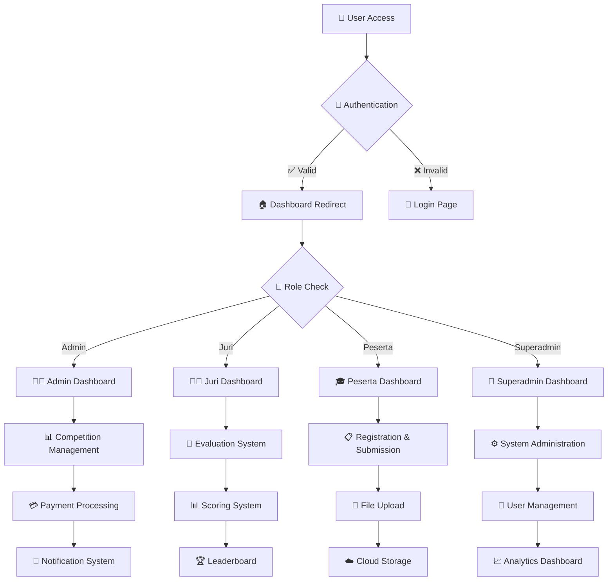
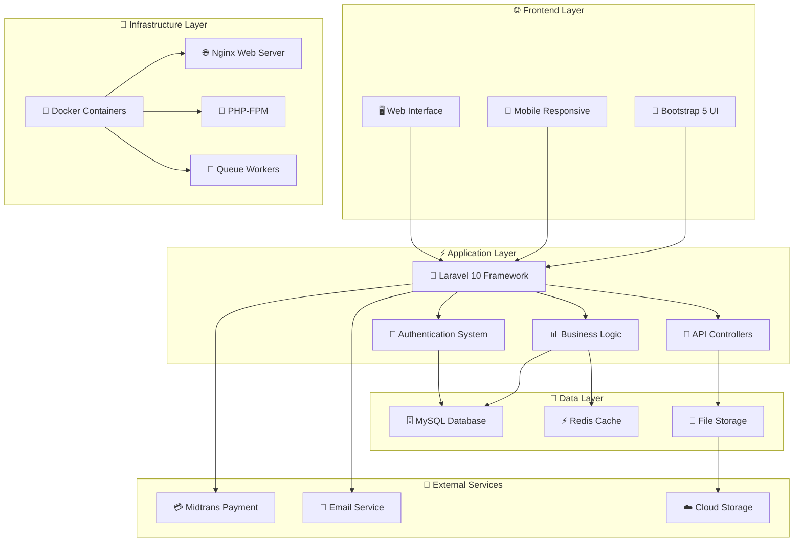
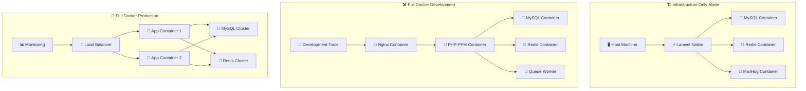
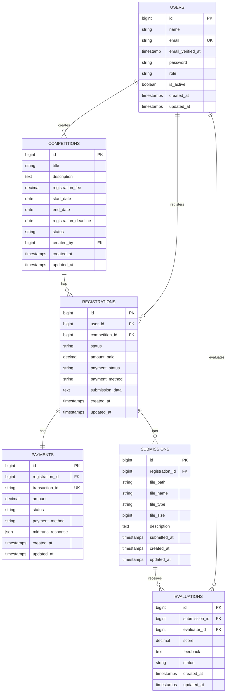
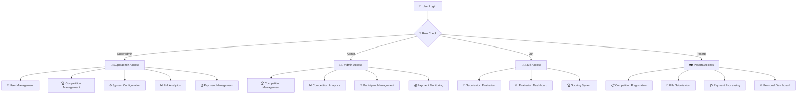

<div align="center">

# 🏆 UNAS Fest 2025 - Platform Kompetisi Digital
### *Platform Kompetisi Nasional Terdepan*
**by Tamas**

---

[](https://github.com/el-pablos/caturnawa-uf-2025)
[](https://laravel.com)
[](https://php.net)
[](https://docker.com)
[](https://mysql.com)
[](https://redis.io)

[](https://github.com/el-pablos/caturnawa-uf-2025)
[](https://github.com/el-pablos/caturnawa-uf-2025)
[](https://github.com/el-pablos/caturnawa-uf-2025)

---

### 🌟 Platform kompetisi Laravel yang komprehensif dengan integrasi pembayaran, manajemen file, sistem pengguna berbasis peran, dan opsi deployment Docker yang fleksibel.

</div>

## 📋 Daftar Isi

<details>
<summary><strong>🔍 Klik untuk melihat navigasi lengkap</strong></summary>

- [🎯 Gambaran Proyek](#-gambaran-proyek)
- [✨ Fitur Utama](#-fitur-utama)
- [🏗️ Arsitektur Sistem](#️-arsitektur-sistem)
- [🚀 Panduan Memulai](#-panduan-memulai)
- [🐳 Mode Deployment Docker](#-mode-deployment-docker)
- [📋 Persyaratan Sistem](#-persyaratan-sistem)
- [🔧 Panduan Instalasi](#-panduan-instalasi)
- [🛠️ Perintah Manajemen](#️-perintah-manajemen)
- [⚙️ Konfigurasi](#️-konfigurasi)
- [🔍 Pemecahan Masalah](#-pemecahan-masalah)
- [🔒 Fitur Keamanan](#-fitur-keamanan)
- [📊 Optimasi Performa](#-optimasi-performa)
- [🧪 Pengujian](#-pengujian)
- [🚀 Deployment Produksi](#-deployment-produksi)
- [📊 Monitoring & Observabilitas](#-monitoring--observabilitas)
- [🤝 Kontribusi](#-kontribusi)
- [📞 Dukungan](#-dukungan)

</details>

---

## 🎯 Gambaran Proyek

<div align="center">

### 🏆 **UNAS Fest 2025** adalah platform kompetisi digital terdepan yang dibangun dengan teknologi modern

</div>

**UNAS Fest 2025** merupakan platform kompetisi komprehensif yang dikembangkan menggunakan **Laravel 10** dan **Bootstrap 5**. Sistem ini mendukung integrasi pembayaran Midtrans, kontrol akses berbasis peran, dashboard analitik, dan menawarkan tiga mode deployment yang fleksibel: Infrastructure Only, Full Docker Development, dan Full Docker Production.

### 🎯 **Visi & Misi**

<table>
<tr>
<td width="50%">

**🎯 VISI**
> Menjadi platform kompetisi digital terdepan yang menghubungkan talenta terbaik Indonesia dalam satu ekosistem yang aman, efisien, dan inovatif.

</td>
<td width="50%">

**🚀 MISI**
> Menyediakan infrastruktur teknologi yang robust, scalable, dan user-friendly untuk mendukung penyelenggaraan kompetisi nasional dengan standar internasional.

</td>
</tr>
</table>

## ✨ Fitur Utama

<div align="center">

### 🌟 **Fitur-fitur canggih yang mendukung penyelenggaraan kompetisi digital berkelas dunia**

</div>

<table>
<tr>
<td width="50%">

### 🔐 **Autentikasi & Otorisasi**
```
✅ Sistem multi-role (Admin, Juri, Peserta, Superadmin)
✅ Redirect dashboard berbasis peran (BUG FIXED)
✅ Autentikasi aman dengan pemisahan peran
✅ Sistem aktivasi akun otomatis
✅ Session management dengan Redis
```

### 💳 **Integrasi Pembayaran**
```
✅ Gateway pembayaran Midtrans
✅ Update status pembayaran real-time
✅ Generasi dan manajemen invoice
✅ Handling notifikasi pembayaran
✅ Multi-channel payment support
```

### 📁 **Manajemen File**
```
✅ Sistem upload file yang aman
✅ Handling submission kompetisi
✅ Manajemen dokumen peserta
✅ Validasi dan sanitasi file
✅ Cloud storage integration
```

</td>
<td width="50%">

### 🏆 **Manajemen Kompetisi**
```
✅ Pembuatan dan manajemen kompetisi
✅ Sistem registrasi peserta
✅ Tracking dan evaluasi submission
✅ Sistem tiket QR Code
✅ Leaderboard real-time
```

### 🐳 **Hybrid Docker Deployment**
```
✅ Infrastructure Only Mode
   MySQL, Redis, MailHog + Laravel native
✅ Full Docker Development Mode
   Environment development lengkap
✅ Full Docker Production Mode
   Deployment produksi teroptimasi
✅ Cross-platform support
   Windows, Linux, macOS
```

### 📊 **Analytics & Reporting**
```
✅ Dashboard analytics real-time
✅ Report kompetisi komprehensif
✅ Monitoring performa sistem
✅ Export data dalam berbagai format
✅ Visualisasi data interaktif
```

</td>
</tr>
</table>

## 🏗️ Arsitektur Sistem

<div align="center">

### 🔧 **Arsitektur Modern dengan Teknologi Terdepan**

</div>

### 📊 **Diagram Alur Aplikasi**



### 🏛️ **Arsitektur Sistem Keseluruhan**



## 🚀 Panduan Memulai

<div align="center">

### 🚀 **Mulai dalam 3 langkah sederhana!**

</div>

### 📋 **Prasyarat**

<table>
<tr>
<td width="33%">

**🐳 Docker**
```bash
Docker & Docker Compose
Minimum RAM: 4GB
Storage: 5GB+
```

</td>
<td width="33%">

**🔧 Git**
```bash
Git version control
SSH key configured
GitHub access
```

</td>
<td width="33%">

**💻 OS Support**
```bash
✅ Linux (Ubuntu/Debian)
✅ macOS (Intel/Apple Silicon)
✅ Windows (WSL2)
```

</td>
</tr>
</table>

---

### 🎯 **Instalasi**

<details>
<summary><strong>📥 LANGKAH 1: Clone Repository</strong></summary>

```bash
# Clone repository
git clone https://github.com/el-pablos/caturnawa-uf-2025.git
cd caturnawa-uf-2025

# Verifikasi struktur project
ls -la
```

</details>

<details>
<summary><strong>⚙️ LANGKAH 2: Pilih Mode Setup</strong></summary>

### 🏗️ **Mode 1: Infrastructure Only** *(Direkomendasikan untuk Development)*
> Jalankan layanan pendukung di Docker, Laravel secara native

```bash
./setup.sh
# Pilih opsi 1 saat diminta
```

**✅ Yang Anda dapatkan:**
- MySQL 8.0, Redis, MailHog dalam container Docker
- Laravel berjalan via `php artisan serve`
- Tools development lengkap (phpMyAdmin, Redis Commander)
- Siklus development cepat dengan debugging native PHP

---

### 🛠️ **Mode 2: Full Docker Development**
> Environment development containerized lengkap

```bash
./setup.sh
# Pilih opsi 2 saat diminta
```

**✅ Yang Anda dapatkan:**
- Aplikasi Laravel lengkap dalam container Docker
- Integrasi Xdebug untuk debugging
- Semua tools development included
- Environment konsisten di semua mesin

---

### 🚀 **Mode 3: Full Docker Production**
> Deployment produksi yang teroptimasi

```bash
./setup.sh
# Pilih opsi 3 saat diminta
```

**✅ Yang Anda dapatkan:**
- Docker images teroptimasi untuk produksi
- OPcache enabled, debug disabled
- Resource limits dan health checks
- Siap untuk deployment produksi

</details>

<details>
<summary><strong>🌐 LANGKAH 3: Akses Aplikasi</strong></summary>

### 🎯 **URL Akses**

<table>
<tr>
<td width="50%">

**🌐 Aplikasi Utama**
- **URL**: http://localhost:8000
- **Health Check**: http://localhost:8000/health
- **Status**: Production Ready

</td>
<td width="50%">

**🛠️ Development Tools**
- **phpMyAdmin**: http://localhost:8080
- **MailHog**: http://localhost:8025
- **Redis Commander**: http://localhost:8081

</td>
</tr>
</table>

</details>

---

## 🐳 Mode Deployment Docker

<div align="center">

### 🔧 **Tiga Mode Deployment untuk Setiap Kebutuhan**

</div>

### 📊 **Diagram Interaksi Container Docker**



### 🔄 **Perbandingan Mode Deployment**

<table>
<tr>
<th width="25%">🏗️ Infrastructure Only</th>
<th width="25%">🛠️ Full Docker Development</th>
<th width="25%">🚀 Full Docker Production</th>
<th width="25%">📊 Performa</th>
</tr>
<tr>
<td>

**✅ Kelebihan:**
- Setup cepat
- Debugging native
- Resource minimal
- Development familiar

**⚠️ Pertimbangan:**
- Butuh PHP lokal
- OS dependency
- Manual setup

</td>
<td>

**✅ Kelebihan:**
- Environment konsisten
- Xdebug terintegrasi
- Isolasi lengkap
- Tools development

**⚠️ Pertimbangan:**
- Resource lebih besar
- Setup kompleks
- Learning curve

</td>
<td>

**✅ Kelebihan:**
- Production optimized
- Scalable
- Security hardened
- Monitoring built-in

**⚠️ Pertimbangan:**
- Resource intensive
- Complex configuration
- Ops knowledge needed

</td>
<td>

**📈 Metrics:**
- **Startup**: 30s
- **Memory**: 2GB
- **CPU**: 2 cores
- **Storage**: 5GB

**🎯 Use Cases:**
- Development
- Testing
- Production
- CI/CD

</td>
</tr>
</table>

### 🏗️ **Mode 1: Infrastructure Only**

<details>
<summary><strong>🔧 Detail Konfigurasi Infrastructure Only</strong></summary>

**🎯 Cocok untuk:** Developer yang prefer development Laravel native dengan layanan containerized

**✅ Yang Anda dapatkan:**
```
🐳 MySQL 8.0     → Container dengan persistent volume
🐳 Redis 7.0     → Container untuk caching & session
🐳 MailHog       → Container untuk email testing
🐳 phpMyAdmin    → Web interface untuk database
🐳 Redis Commander → Web interface untuk Redis
⚡ Laravel       → Berjalan native di host machine
```

**🚀 Setup & Penggunaan:**
```bash
# Setup interaktif
./setup.sh  # Pilih opsi 1

# Atau perintah langsung
make infra

# Start Laravel development server
make serve  # atau php artisan serve --host=0.0.0.0 --port=8000
```

**📊 Resource Requirements:**
- **RAM**: 1-2GB
- **CPU**: 1-2 cores
- **Storage**: 2GB
- **Startup Time**: ~30 detik

</details>

### 🛠️ **Mode 2: Full Docker Development**

<details>
<summary><strong>🔧 Detail Konfigurasi Full Docker Development</strong></summary>

**🎯 Cocok untuk:** Tim development yang butuh environment konsisten

**✅ Yang Anda dapatkan:**
```
🐳 Nginx         → Web server dengan SSL support
🐳 PHP-FPM 8.3   → Application server dengan Xdebug
🐳 MySQL 8.0     → Database dengan development config
🐳 Redis 7.0     → Cache & session store
🐳 Queue Worker  → Background job processing
🐳 Scheduler     → Cron job handling
🔧 Dev Tools     → phpMyAdmin, MailHog, Redis Commander
```

**🚀 Setup & Penggunaan:**
```bash
# Setup interaktif
./setup.sh  # Pilih opsi 2

# Atau perintah langsung
make dev

# Akses aplikasi
curl http://localhost:8000/health
```

**🐛 Konfigurasi Xdebug:**
```bash
# Set di .env
DOCKER_TARGET=development
XDEBUG_MODE=debug

# Konfigurasi IDE:
Host: localhost
Port: 9003
Path Mapping: /var/www/html → ./
```

**📊 Resource Requirements:**
- **RAM**: 4-6GB
- **CPU**: 2-4 cores
- **Storage**: 5GB
- **Startup Time**: ~60 detik

</details>

### 🚀 **Mode 3: Full Docker Production**

<details>
<summary><strong>🔧 Detail Konfigurasi Full Docker Production</strong></summary>

**🎯 Cocok untuk:** Deployment produksi dengan optimasi performa

**✅ Yang Anda dapatkan:**
```
🐳 Load Balancer → Nginx dengan SSL termination
🐳 App Containers → Multi-instance untuk high availability
🐳 MySQL Cluster → Master-slave replication
🐳 Redis Cluster → High availability caching
📊 Monitoring    → Health checks & metrics
🔒 Security      → Hardened containers & networks
```

**🚀 Setup & Penggunaan:**
```bash
# Setup interaktif
./setup.sh  # Pilih opsi 3

# Atau perintah langsung
make prod

# Verifikasi deployment
make health
```

**⚡ Optimasi Produksi:**
```bash
# OPcache enabled
opcache.enable=1
opcache.memory_consumption=256

# Debug disabled
APP_DEBUG=false
APP_ENV=production

# Resource limits
memory_limit=512M
max_execution_time=300
```

**📊 Resource Requirements:**
- **RAM**: 8-16GB
- **CPU**: 4-8 cores
- **Storage**: 20GB+
- **Startup Time**: ~120 detik

</details>

---

## 📋 Persyaratan Sistem

<div align="center">

### 💻 **Spesifikasi Sistem yang Direkomendasikan**

</div>

### 🖥️ **Persyaratan Hardware**

<table>
<tr>
<th width="25%">🏗️ Infrastructure Only</th>
<th width="25%">🛠️ Full Docker Dev</th>
<th width="25%">🚀 Full Docker Prod</th>
<th width="25%">☁️ Cloud Deployment</th>
</tr>
<tr>
<td>

**💾 RAM**
```
Minimum: 2GB
Recommended: 4GB
Optimal: 8GB
```

**🖥️ CPU**
```
Minimum: 2 cores
Recommended: 4 cores
Optimal: 8 cores
```

**💿 Storage**
```
Minimum: 5GB
Recommended: 10GB
Optimal: 20GB SSD
```

</td>
<td>

**💾 RAM**
```
Minimum: 4GB
Recommended: 8GB
Optimal: 16GB
```

**🖥️ CPU**
```
Minimum: 4 cores
Recommended: 6 cores
Optimal: 8 cores
```

**💿 Storage**
```
Minimum: 10GB
Recommended: 20GB
Optimal: 50GB SSD
```

</td>
<td>

**💾 RAM**
```
Minimum: 8GB
Recommended: 16GB
Optimal: 32GB
```

**🖥️ CPU**
```
Minimum: 4 cores
Recommended: 8 cores
Optimal: 16 cores
```

**💿 Storage**
```
Minimum: 20GB
Recommended: 50GB
Optimal: 100GB SSD
```

</td>
<td>

**☁️ AWS/GCP/Azure**
```
t3.medium (2vCPU, 4GB)
t3.large (2vCPU, 8GB)
t3.xlarge (4vCPU, 16GB)
```

**🐳 Kubernetes**
```
Minimum: 3 nodes
CPU: 2 cores/node
RAM: 4GB/node
```

**📊 Load Balancer**
```
Application LB
SSL termination
Health checks
```

</td>
</tr>
</table>

### 🌐 **Kompatibilitas Sistem Operasi**

<table>
<tr>
<td width="33%">

**🐧 Linux**
```
✅ Ubuntu 20.04+ LTS
✅ Debian 11+
✅ CentOS 8+
✅ RHEL 8+
✅ Arch Linux
✅ Fedora 35+
```

</td>
<td width="33%">

**🍎 macOS**
```
✅ macOS 11 Big Sur+
✅ macOS 12 Monterey
✅ macOS 13 Ventura
✅ macOS 14 Sonoma
✅ Intel & Apple Silicon
✅ Docker Desktop
```

</td>
<td width="33%">

**🪟 Windows**
```
✅ Windows 10 Pro/Enterprise
✅ Windows 11 Pro/Enterprise
✅ WSL2 enabled
✅ Docker Desktop
✅ PowerShell 7+
✅ Git for Windows
```

</td>
</tr>
</table>

### 🛠️ **Dependensi Software**

<details>
<summary><strong>🏗️ Untuk Mode Infrastructure Only</strong></summary>

```bash
# Core Requirements
✅ PHP 8.3+ dengan ekstensi:
   - php-mysql, php-redis, php-gd
   - php-zip, php-mbstring, php-xml
   - php-curl, php-intl, php-bcmath

✅ Composer 2.x
✅ Node.js 18+ & NPM
✅ Docker & Docker Compose
✅ Git 2.x
```

</details>

<details>
<summary><strong>🛠️ Untuk Mode Full Docker</strong></summary>

```bash
# Minimal Requirements
✅ Docker 20.10+
✅ Docker Compose 2.x
✅ Git 2.x
✅ Make (optional, untuk management commands)

# Tidak perlu instalasi PHP, MySQL, Redis lokal
# Semua dependensi dalam container
```

</details>

### 🗄️ **Database Entity Relationship Diagram**



### 👥 **User Role & Permission Flow**



---

## 🔧 Panduan Instalasi

<div align="center">

### 🛠️ **Instalasi Step-by-Step untuk Semua Platform**

</div>

### 🐳 **Instalasi Docker**

<details>
<summary><strong>🐧 Linux (Ubuntu/Debian)</strong></summary>

```bash
# 1. Update package index
sudo apt update && sudo apt upgrade -y

# 2. Install dependencies
sudo apt install -y apt-transport-https ca-certificates curl gnupg lsb-release

# 3. Add Docker GPG key
curl -fsSL https://download.docker.com/linux/ubuntu/gpg | sudo gpg --dearmor -o /usr/share/keyrings/docker-archive-keyring.gpg

# 4. Add Docker repository
echo "deb [arch=$(dpkg --print-architecture) signed-by=/usr/share/keyrings/docker-archive-keyring.gpg] https://download.docker.com/linux/ubuntu $(lsb_release -cs) stable" | sudo tee /etc/apt/sources.list.d/docker.list > /dev/null

# 5. Install Docker
sudo apt update
sudo apt install -y docker-ce docker-ce-cli containerd.io docker-compose-plugin

# 6. Add user to docker group
sudo usermod -aG docker $USER

# 7. Start Docker service
sudo systemctl enable docker
sudo systemctl start docker

# 8. Install Docker Compose (standalone)
sudo curl -L "https://github.com/docker/compose/releases/latest/download/docker-compose-$(uname -s)-$(uname -m)" -o /usr/local/bin/docker-compose
sudo chmod +x /usr/local/bin/docker-compose

# 9. Logout and login again, then verify
newgrp docker
docker --version
docker-compose --version
```

**✅ Verifikasi Instalasi:**
```bash
docker run hello-world
docker-compose --version
```

</details>

<details>
<summary><strong>🍎 macOS (Intel & Apple Silicon)</strong></summary>

**📥 Metode 1: Docker Desktop (Direkomendasikan)**
```bash
# 1. Download Docker Desktop
# Visit: https://www.docker.com/products/docker-desktop

# 2. Install Docker Desktop
# Drag to Applications folder

# 3. Start Docker Desktop
# Launch from Applications

# 4. Verify installation
docker --version
docker-compose --version
```

**🍺 Metode 2: Homebrew**
```bash
# 1. Install Homebrew (jika belum ada)
/bin/bash -c "$(curl -fsSL https://raw.githubusercontent.com/Homebrew/install/HEAD/install.sh)"

# 2. Install Docker Desktop via Homebrew
brew install --cask docker

# 3. Start Docker Desktop
open /Applications/Docker.app

# 4. Verify installation
docker --version
docker-compose --version
```

**⚙️ Konfigurasi untuk Apple Silicon:**
```bash
# Set platform untuk compatibility
export DOCKER_DEFAULT_PLATFORM=linux/amd64

# Add to ~/.zshrc or ~/.bash_profile
echo 'export DOCKER_DEFAULT_PLATFORM=linux/amd64' >> ~/.zshrc
```

</details>

<details>
<summary><strong>🪟 Windows (WSL2)</strong></summary>

**📋 Prerequisites:**
```powershell
# 1. Enable WSL2
dism.exe /online /enable-feature /featurename:Microsoft-Windows-Subsystem-Linux /all /norestart
dism.exe /online /enable-feature /featurename:VirtualMachinePlatform /all /norestart

# 2. Restart computer
# 3. Set WSL2 as default
wsl --set-default-version 2

# 4. Install Ubuntu from Microsoft Store
# Search "Ubuntu" in Microsoft Store
```

**🐳 Install Docker Desktop:**
```powershell
# 1. Download Docker Desktop for Windows
# Visit: https://www.docker.com/products/docker-desktop

# 2. Run installer with admin privileges
# Enable WSL2 integration during installation

# 3. Restart computer

# 4. Configure Docker Desktop
# Settings → General → Use WSL2 based engine ✅
# Settings → Resources → WSL Integration → Enable Ubuntu ✅
```

**✅ Verifikasi di WSL2:**
```bash
# Open Ubuntu terminal
wsl

# Verify Docker
docker --version
docker-compose --version

# Test Docker
docker run hello-world
```

</details>

### 🛠️ **Dependensi Native (Khusus Mode Infrastructure Only)**

<details>
<summary><strong>🐘 Instalasi PHP 8.3+</strong></summary>

**🐧 Linux (Ubuntu/Debian):**
```bash
# 1. Add PHP repository
sudo add-apt-repository ppa:ondrej/php -y
sudo apt update

# 2. Install PHP 8.3 dan ekstensi
sudo apt install -y php8.3 php8.3-cli php8.3-fpm \
    php8.3-mysql php8.3-redis php8.3-gd php8.3-zip \
    php8.3-mbstring php8.3-xml php8.3-curl php8.3-intl \
    php8.3-bcmath php8.3-soap php8.3-xdebug

# 3. Verify installation
php -v
php -m | grep -E "(mysql|redis|gd|zip|mbstring|xml|curl)"
```

**🍎 macOS:**
```bash
# 1. Install PHP via Homebrew
brew install php@8.3

# 2. Install Redis extension
brew install php@8.3-redis

# 3. Link PHP
brew link php@8.3 --force

# 4. Add to PATH (add to ~/.zshrc or ~/.bash_profile)
echo 'export PATH="/opt/homebrew/bin:$PATH"' >> ~/.zshrc
source ~/.zshrc

# 5. Verify installation
php -v
```

**🪟 Windows:**
```powershell
# Option 1: Download PHP manually
# 1. Download from: https://windows.php.net/download/
# 2. Extract to C:\php
# 3. Add C:\php to PATH
# 4. Copy php.ini-development to php.ini
# 5. Enable extensions in php.ini

# Option 2: Use XAMPP (Easier)
# 1. Download XAMPP: https://www.apachefriends.org/
# 2. Install with PHP 8.3+
# 3. Add C:\xampp\php to PATH
```

</details>

<details>
<summary><strong>🎼 Instalasi Composer</strong></summary>

**🌐 Global Installation:**
```bash
# 1. Download Composer installer
curl -sS https://getcomposer.org/installer | php

# 2. Move to global location
sudo mv composer.phar /usr/local/bin/composer

# 3. Make executable
sudo chmod +x /usr/local/bin/composer

# 4. Verify installation
composer --version
```

**🪟 Windows:**
```powershell
# 1. Download Composer-Setup.exe
# Visit: https://getcomposer.org/download/

# 2. Run installer
# Follow installation wizard

# 3. Verify in Command Prompt
composer --version
```

</details>

<details>
<summary><strong>🟢 Instalasi Node.js & NPM</strong></summary>

**🐧 Linux:**
```bash
# 1. Install Node.js 18 LTS
curl -fsSL https://deb.nodesource.com/setup_18.x | sudo -E bash -
sudo apt-get install -y nodejs

# 2. Verify installation
node --version
npm --version

# 3. Update npm to latest
sudo npm install -g npm@latest
```

**🍎 macOS:**
```bash
# 1. Install via Homebrew
brew install node@18

# 2. Link Node.js
brew link node@18

# 3. Verify installation
node --version
npm --version
```

**🪟 Windows:**
```powershell
# 1. Download Node.js LTS
# Visit: https://nodejs.org/

# 2. Run installer
# Follow installation wizard

# 3. Verify in Command Prompt
node --version
npm --version
```

</details>

---

## 🛠️ Perintah Manajemen

<div align="center">

### ⚡ **40+ Perintah untuk Manajemen Efisien**

</div>

### 🚀 **Perintah Cepat**

<table>
<tr>
<td width="50%">

**🎯 Setup & Deployment**
```bash
make help           # Tampilkan semua perintah
make setup          # Setup interaktif hybrid
make infra          # Start infrastructure only
make dev            # Start development environment
make prod           # Start production environment
make serve          # Start Laravel dev server
```

**🐳 Operasi Docker**
```bash
make build          # Build Docker images
make up             # Start semua services
make down           # Stop semua services
make restart        # Restart semua services
make status         # Tampilkan status services
```

</td>
<td width="50%">

**⚡ Laravel Operations**
```bash
make artisan cmd="migrate"     # Jalankan artisan commands
make migrate                   # Jalankan database migrations
make migrate-fresh            # Fresh migration + seeding
make seed                     # Jalankan database seeders
make cache-clear              # Bersihkan semua cache
make cache-optimize           # Optimasi cache produksi
make composer-install         # Install Composer dependencies
make composer-update          # Update Composer dependencies
```

</td>
</tr>
</table>

### 🗄️ **Operasi Database**

<details>
<summary><strong>💾 Database Management Commands</strong></summary>

```bash
# Backup & Restore
make db-backup                    # Backup database ke file SQL
make db-restore file="backup.sql" # Restore database dari file
make db-fresh                     # Reset database + seed data

# Database Access
make mysql                        # Akses MySQL CLI
make mysql-root                   # Akses MySQL sebagai root
make redis                        # Akses Redis CLI

# Database Monitoring
make db-status                    # Status database connection
make db-size                      # Ukuran database
make db-tables                    # List semua tables
```

</details>

### 🧪 **Testing & Quality Assurance**

<details>
<summary><strong>🔬 Testing Commands</strong></summary>

```bash
# Test Execution
make test                         # Jalankan semua tests
make test-feature                 # Jalankan feature tests
make test-unit                    # Jalankan unit tests
make test-coverage                # Test dengan coverage report
make test-parallel                # Jalankan tests secara parallel

# Specific Testing
make test-filter name="UserTest"  # Test specific class
make test-group name="auth"       # Test specific group
make test-watch                   # Watch mode untuk development

# Code Quality
make phpstan                      # Static analysis
make php-cs-fixer                 # Code style fixer
make phpmd                        # Mess detector
```

</details>

### 🔧 **Container Access & Debugging**

<details>
<summary><strong>🐚 Container Management</strong></summary>

```bash
# Container Access
make shell                        # Akses application container
make shell-mysql                  # Akses MySQL container
make shell-redis                  # Akses Redis container
make shell-nginx                  # Akses Nginx container

# Logs & Monitoring
make logs                         # Tampilkan semua logs
make logs-app                     # Logs aplikasi Laravel
make logs-mysql                   # Logs MySQL
make logs-redis                   # Logs Redis
make logs-nginx                   # Logs Nginx
make logs-follow                  # Follow logs real-time

# Health Checks
make health                       # Check application health
make health-detailed              # Detailed health check
make health-services              # Check all services health
```

</details>

### 🧹 **Maintenance & Cleanup**

<details>
<summary><strong>🔧 Maintenance Commands</strong></summary>

```bash
# Cleanup Operations
make clean                        # Bersihkan Docker resources
make clean-all                    # Bersihkan semua (termasuk images)
make clean-volumes                # Bersihkan Docker volumes
make clean-cache                  # Bersihkan application cache

# File Permissions
make permissions                  # Fix file permissions
make permissions-storage          # Fix storage permissions
make permissions-bootstrap        # Fix bootstrap cache permissions

# System Maintenance
make optimize                     # Optimasi aplikasi
make update                       # Update dependencies
make security-check               # Security vulnerability check
```

</details>

### 📊 **Monitoring & Analytics**

<details>
<summary><strong>📈 Monitoring Commands</strong></summary>

```bash
# Performance Monitoring
make stats                        # Container resource usage
make top                          # Real-time container stats
make disk-usage                   # Disk usage analysis
make memory-usage                 # Memory usage analysis

# Application Monitoring
make queue-status                 # Queue worker status
make queue-restart                # Restart queue workers
make schedule-list                # List scheduled tasks
make schedule-run                 # Run scheduled tasks manually

# Security Monitoring
make security-scan                # Security vulnerability scan
make audit-logs                   # Audit application logs
make check-updates                # Check for security updates
```

</details>

## ⚙️ Configuration

### Environment Variables
Copy the appropriate environment template:
- `.env.example.infrastructure` - For infrastructure mode
- `.env.example.docker` - For full Docker modes

**Required configurations:**
```env
# Database passwords (CHANGE THESE!)
DB_PASSWORD=your_secure_password_here
DB_ROOT_PASSWORD=your_root_password_here

# Midtrans configuration (REQUIRED for payments)
MIDTRANS_SERVER_KEY=your_midtrans_server_key
MIDTRANS_CLIENT_KEY=your_midtrans_client_key

# Email configuration (REQUIRED for notifications)
MAIL_HOST=smtp.gmail.com
MAIL_USERNAME=your_email@gmail.com
MAIL_PASSWORD=your_app_password
```

### Services Overview

| Service | Container Name | Port | Description |
|---------|---------------|------|-------------|
| Laravel App | unas_fest_app | 8000 | Main application with Nginx + PHP-FPM |
| MySQL | unas_fest_mysql | 3306 | Database server |
| Redis | unas_fest_redis | 6379 | Cache & session store |
| Queue Worker | unas_fest_queue | - | Background job processing |
| Scheduler | unas_fest_scheduler | - | Cron job handling |
| phpMyAdmin | unas_fest_phpmyadmin | 8080 | Database management (dev only) |
| MailHog | unas_fest_mailhog | 8025 | Email testing (dev only) |
| Redis Commander | unas_fest_redis_commander | 8081 | Redis management (dev only) |

## 🔍 Troubleshooting

### Common Issues

#### Port Already in Use
```bash
# Check what's using the port
sudo lsof -i :8000
sudo lsof -i :3306

# Change ports in .env file
APP_PORT=8001
DB_PORT=3307
```

#### Permission Issues
```bash
# Fix storage permissions
docker-compose exec app chown -R www-data:www-data storage bootstrap/cache
docker-compose exec app chmod -R 755 storage bootstrap/cache

# Or using make command
make permissions
```

#### Database Connection Failed
```bash
# Check MySQL container status
docker-compose ps mysql
docker-compose logs mysql

# Verify database credentials in .env
# Wait for MySQL to fully initialize (can take 1-2 minutes)
```

#### Application Key Missing
```bash
# Generate application key
docker-compose exec app php artisan key:generate

# Or for infrastructure mode
php artisan key:generate
```

#### Composer Install Fails
```bash
# Clear Composer cache
docker-compose exec app composer clear-cache

# Install with verbose output
docker-compose exec app composer install -vvv
```

### Performance Issues

#### Slow File Operations (macOS/Windows)
```bash
# Use cached/delegated volume mounts (already configured in dev setup)
# Consider using Docker Desktop with VirtioFS (macOS) or WSL2 (Windows)
```

#### High Memory Usage
```bash
# Limit container memory in docker-compose.yml
services:
  app:
    deploy:
      resources:
        limits:
          memory: 512M
```

### Debugging

#### Container Won't Start
```bash
# Check container logs
docker-compose logs app

# Check container status
docker-compose ps

# Rebuild without cache
docker-compose build --no-cache app
```

#### Application Errors
```bash
# Check Laravel logs
docker-compose exec app tail -f storage/logs/laravel.log

# Check Nginx logs
docker-compose logs app | grep nginx

# Enable debug mode temporarily
# Set APP_DEBUG=true in .env, then restart
docker-compose restart app
```

## 🔒 Security Features

### Authentication & Authorization
- **FIXED**: Authentication redirect bug - all user roles now redirect to correct dashboards
- Multi-role user system with proper role separation
- Secure password hashing with bcrypt
- Session management with Redis
- CSRF protection on all forms

### Application Security
- SQL injection prevention with parameter binding
- Mass assignment protection
- File upload security with sanitization
- XSS prevention with output escaping
- Security headers implementation
- Input validation and sanitization

### Container Security
- Non-root user execution (www-data)
- Minimal base images (Alpine Linux)
- Security scanning with regular image updates
- Read-only filesystem where possible
- Network isolation with custom Docker networks

### Production Security
```bash
# Use Docker secrets for sensitive data
echo "your_secret_password" | docker secret create db_password -

# Reference in compose file
services:
  mysql:
    secrets:
      - db_password
    environment:
      MYSQL_ROOT_PASSWORD_FILE: /run/secrets/db_password
```

### Network Security
```yaml
# Restrict network access
services:
  app:
    networks:
      - frontend
      - backend

  mysql:
    networks:
      - backend  # No frontend access

networks:
  frontend:
    driver: bridge
  backend:
    driver: bridge
    internal: true  # No external access
```

## 📊 Performance Optimizations

### Production Optimizations
- Redis caching for sessions and application cache
- Database query optimization (N+1 prevention)
- OPcache for production environments
- Optimized Docker images with multi-stage builds
- CDN-ready asset compilation

### Container Optimizations
- Multi-stage Docker builds for smaller images
- Alpine Linux base images for security and size
- Resource limits and health checks
- Proper volume mounting for persistent data
- Network optimization with custom bridges

## 🧪 Testing

### Running Tests
```bash
# All tests
make test

# Feature tests
make test-feature

# Unit tests
make test-unit

# With coverage
make test-coverage

# Specific test
docker-compose exec app php artisan test --filter=UserTest
```

### Database Testing
```bash
# Create test database
docker-compose exec mysql mysql -u root -p -e "CREATE DATABASE unas_fest_2025_test;"

# Run migrations for testing
docker-compose exec app php artisan migrate --database=mysql_test

# Seed test data
docker-compose exec app php artisan db:seed --database=mysql_test
```

## 🚀 Production Deployment

### Docker Production Setup
```bash
# Production deployment
./setup.sh  # Select option 3

# Or direct command
make prod

# Deploy with updates
git pull origin master
make prod
```

### Production Environment Variables
```env
APP_ENV=production
APP_DEBUG=false
DOCKER_TARGET=production

# Security
DB_PASSWORD=strong_production_password
DB_ROOT_PASSWORD=strong_root_password

# Performance
CACHE_DRIVER=redis
SESSION_DRIVER=redis
QUEUE_CONNECTION=redis
```

### SSL/HTTPS Setup
```bash
# Using Let's Encrypt with Certbot
docker run -it --rm \
  -v /etc/letsencrypt:/etc/letsencrypt \
  -v /var/www/certbot:/var/www/certbot \
  certbot/certbot certonly --webroot \
  -w /var/www/certbot \
  -d yourdomain.com
```

### Load Balancing
```yaml
# docker-compose.lb.yml
version: '3.8'
services:
  nginx-lb:
    image: nginx:alpine
    ports:
      - "80:80"
      - "443:443"
    volumes:
      - ./nginx-lb.conf:/etc/nginx/nginx.conf
    depends_on:
      - app1
      - app2

  app1:
    extends:
      file: docker-compose.yml
      service: app

  app2:
    extends:
      file: docker-compose.yml
      service: app
```

## 📊 Monitoring & Observability

### Application Metrics
```bash
# Install Laravel Telescope for debugging
docker-compose exec app composer require laravel/telescope --dev
docker-compose exec app php artisan telescope:install
docker-compose exec app php artisan migrate
```

### Container Monitoring
```bash
# Resource usage
docker stats

# Container health
docker-compose ps
docker inspect unas_fest_app --format='{{.State.Health.Status}}'
```

### Health Checks
```bash
# Application health
curl http://localhost:8000/health

# Service health
make health
## 🤝 Contributing

1. Fork the repository
2. Create a feature branch: `git checkout -b feature/new-feature`
3. Make your changes and test thoroughly
4. Commit with conventional format: `git commit -m "feat: add new feature"`
5. Push to your branch: `git push origin feature/new-feature`
6. Submit a pull request

## 📁 Project Structure

```
unas-fest-2025/
├── 🐳 Docker Configuration
│   ├── Dockerfile                        # Multi-stage Docker build
│   ├── docker-compose.yml                # Production services
│   ├── docker-compose.dev.yml            # Development overrides
│   ├── docker-compose.infrastructure.yml # Infrastructure-only services
│   └── docker/                           # Service configurations
│       ├── php/                          # PHP configurations
│       ├── nginx/                        # Nginx configurations
│       ├── mysql/                        # MySQL configurations
│       └── redis/                        # Redis configurations
├── 🚀 Setup Scripts
│   ├── setup.sh                          # Hybrid setup script
│   ├── docker-setup.sh                   # Legacy Docker setup
│   └── Makefile                          # Management commands
├── ⚙️ Environment Templates
│   ├── .env.example.docker               # Full Docker mode
│   └── .env.example.infrastructure       # Infrastructure mode
├── 📚 Documentation
│   └── README.md                         # This comprehensive guide
└── 🎯 Laravel Application
    ├── app/                              # Application code
    ├── resources/                        # Views, assets, lang
    ├── routes/                           # Route definitions
    ├── database/                         # Migrations, seeders
    └── storage/                          # Logs, cache, uploads
```

## 🔧 Architecture Overview

### Container Architecture
```
┌─────────────────────────────────────────────────────────────┐
│                    Docker Network                           │
│  ┌─────────────┐  ┌─────────────┐  ┌─────────────────────┐  │
│  │    Nginx    │  │  PHP-FPM    │  │    Laravel App      │  │
│  │   (Port 80) │◄─┤   (9000)    │◄─┤   (Application)    │  │
│  └─────────────┘  └─────────────┘  └─────────────────────┘  │
│         │                                    │               │
│         ▼                                    ▼               │
│  ┌─────────────┐  ┌─────────────┐  ┌─────────────────────┐  │
│  │   MySQL     │  │    Redis    │  │   Queue Worker      │  │
│  │  (Port 3306)│  │ (Port 6379) │  │   (Background)      │  │
│  └─────────────┘  └─────────────┘  └─────────────────────┘  │
└─────────────────────────────────────────────────────────────┘
```

### Data Flow
1. **HTTP Request** → Nginx → PHP-FPM → Laravel
2. **Database** → MySQL with persistent volume
3. **Cache/Sessions** → Redis with persistent volume
4. **File Uploads** → Local storage with volume mount
5. **Background Jobs** → Queue Worker → Redis Queue
6. **Scheduled Tasks** → Scheduler Container → Cron Jobs

## 📄 License

This project is licensed under the MIT License - see the [LICENSE](LICENSE) file for details.

## 🙏 Acknowledgments

- Laravel Framework
- Midtrans Payment Gateway
- Docker Community
- UNAS Fest 2025 Team

## 📞 Support

- **Issues**: [GitHub Issues](https://github.com/el-pablos/caturnawa-uf-2025/issues)
- **Repository**: https://github.com/el-pablos/caturnawa-uf-2025.git
- **Email**: support@unasfest2025.com

## 🎯 Key Achievements

### ✅ Authentication Bug Fix
- **FIXED**: Authentication redirect issue where all user roles redirected to `/peserta/dashboard`
- **RESOLVED**: 403 errors regardless of user role
- **IMPLEMENTED**: Proper role-based dashboard redirection:
  - Admin → `/admin/dashboard`
  - Juri → `/juri/dashboard`
  - Superadmin → `/admin/dashboard`
  - Peserta → `/peserta/dashboard`

### ✅ Hybrid Docker Implementation
- **Infrastructure Only Mode**: MySQL, Redis, MailHog in Docker + Laravel native
- **Full Docker Development**: Complete containerized development environment
- **Full Docker Production**: Optimized production deployment
- **Cross-Platform Support**: Windows (WSL2), Linux, macOS compatibility
- **One-Command Setup**: Interactive setup script with OS detection

### ✅ Developer Experience
- **Flexible Deployment**: Choose between native Laravel or full Docker
- **Comprehensive Documentation**: All setup modes documented
- **Management Commands**: 40+ make commands for easy management
- **Troubleshooting Guides**: Platform-specific solutions
- **Professional Implementation**: Clean code with "by Tamas" signature

### ✅ Production Ready
- **Security Features**: CSRF protection, input validation, SQL injection prevention
- **Performance Optimizations**: Redis caching, OPcache, optimized Docker images
- **Monitoring**: Health checks, logging, container monitoring
- **Scalability**: Load balancing ready, resource limits configured

---

**🎉 UNAS Fest 2025 - Competition Platform**
**Made with ❤️ by Tamas**

*Ready for development and production deployment with maximum flexibility and cross-platform compatibility!* 🚀
